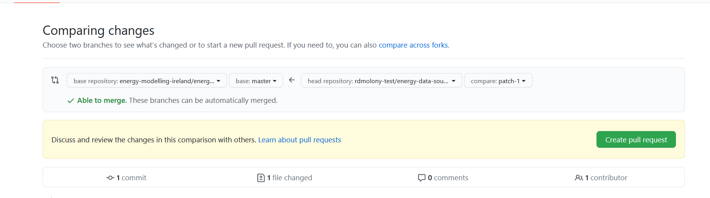

Energy Data Sources
===================

This repository contains URL links & descriptions to a collection of energy-related data sources for Ireland.  

All of the data listed here is either __open access__ or is accessible via an application process with the relevant body (these sources are marked explicitely as __`Available upon request`__).   

__Have a new data source to add or found a broken data source URL?__ Great! Please email us at `energy-modelling-ireland-admin@googlegroups.com` with:

```
Name of source:  Irish Social Science Data Archive (ISSDA)

Short description:  "The Irish Social Science Data Archive (ISSDA) is Ireland’s leading centre for quantitative data acquisition, preservation, and dissemination. Based at UCD Library, its mission is to ensure wide access to quantitative datasets in the social sciences, and to advance the promotion of international comparative studies of the Irish economy and Irish society."

URL link to source:  https://www.ucd.ie/issda/data/

The Raw Data file (if there is currently no URL to the data source)
```

__Want to contribute through Github instead?__ Please follow the [`how-to-contribute`](#how-to-contribute) guide below.  All changes will be reviewed prior to being published on this website so don't worry about breaking anything with your edits :smiley: 


---


Table of Contents
=================

<!--ts-->
* [Table of Contents](#table-of-contents)
* [Data Catalogues](#data-catalogues)
* [Energy Consumption](#energy-consumption)
* [Building Fabric](#building-fabric)
* [Appliance Usage](#appliance-usage)
* [Geodata](#geodata)
* [Benchmarks](#benchmarks)
* [Emissions, Waste and Landfill](#emissions-waste-and-landfill)
* [How to Contribute?](#how-to-contribute)
<!--te-->


---


Data Catalogues
===============

Irish Social Science Data Archive (ISSDA)
-----------------------------------------
- "The Irish Social Science Data Archive (ISSDA) is Ireland’s leading centre for quantitative data acquisition, preservation, and dissemination. Based at UCD Library, its mission is to ensure wide access to quantitative datasets in the social sciences, and to advance the promotion of international comparative studies of the Irish economy and Irish society."
- https://www.ucd.ie/issda/data/

UK Energy Research Centre (UKERC) Data Catalogue   
------------------------------------------------
- Compilation of energy related publications for the United Kingdom
- https://ukerc.rl.ac.uk/DC/cgi-bin/edc_search.pl?GoButton=Related&WantComp=40


---


Energy Consumption
==================

Commission for Regulation of Utilities (CRU) Smart Meter Trials
---------------------------------------------------------------
- `Available upon request`
- Electricity meter data at 15-minute resolution for a sample of 5,000 Irish homes and businesses between 2009-10
- Gas meter data at 15-minute resolution for a representative sample of nearly 2,000 Irish homes between 2010-11
- https://www.ucd.ie/issda/data/commissionforenergyregulationcer/

Carbon Trust Advanced Metering Trial (2004-2006)
------------------------------------------------
- `Available upon request`
- Half hourly gas and electricity (and water) consumption data ( not all utilities were monitored at every site) gathered during the Carbon Trusts Advanced Metering for SMEs project (2004-2006) in United Kingdom Regions of England, Wales and Scotland.  
- Meter readings are available for small and medium-sized enterprises (SMEs).  The sectors covered are:
  - Community, social and personal activities
  - Education
  - Financial and business services
  - Government
  - Health and social work
  - Manufacturing
  - Other sectors
  - Wholesale and retail trade
- https://ukerc.rl.ac.uk/DC/cgi-bin/edc_search.pl/?WantComp=30

Gas Network's Ireland Networked Gas Consumption
-----------------------------------------------
- Annual Gas consumption data for all Irish Power Plants, Residential & Non-Residential
- https://www.cso.ie/en/statistics/climateandenergy/networkedgasconsumption/

Environmental Protection Agency (EPA) Annual Energy Use
-------------------------------------------------------
- Annual Gas & Electricity data for Emissions Trading System (ETS) industrial buildings 
- http://epa.ie/licensing/

Mortar
------
- "The goal of Mortar is to provide a large, diverse and consistently updated testbed of buildings and building data to facilitate reproducible evaluation of building analytics.  At this time, Mortar contains 107 buildings, spanning over 10 billion data points and 26,000 data streams."
- https://mortardata.org/


---


Building Fabric
===============

SEAI's 2016 Census Small Area Statistics
----------------------------------------
- Building data (period built, dwelling type, boiler type ...) for all households in Ireland who participated in the 2016 Census at Small Area level (i.e. areas of population generally comprising between 80 and 120 dwellings). 
- https://www.cso.ie/en/census/census2016reports/census2016smallareapopulationstatistics/
- Click `Small Areas (18,641) -` to download a `csv` file containing the Small Area Statistics.
- Click `SAPS 2016 Glossary (XLS 38KB)` to download an `xlsx` file containing the column name decodings (for example: from `T6_1_HB_H` decodes to `House/Bungalow (No. of households)`).
  - See [drem](https://github.com/codema-dev/drem) for more information on cleaning this data set for Dublin using Python.

SEAI's BER Public Search
------------------------
- Building data (type of heating, building geometry ...) for all households in Ireland who have had their household's BER rating evaluated.
- Updated nightly
- https://ndber.seai.ie/BERResearchTool/Register/Register.aspx

Valuation Office API
--------------------
- Building data (floor areas ...) for all Commercial buildings in Ireland
- __Note:__ Apply benchmarks to these floor areas to estimate commercial building energy usage
- https://opendata.valoff.ie/api/


---

Appliance Usage
===============

United Kingdom Time Use Survey, 2014-2015
-----------------------------------------
- "The United Kingdom Time Use Survey, 2014-2015 (UKTUS) is a large-scale household survey that provides data on how people aged 8 years and over in the UK spend their time. At the heart of the survey is a time diary instrument in which respondents record their daily activities. Time diaries record events sequences for prescribed periods, usually a single day."
- https://beta.ukdataservice.ac.uk/datacatalogue/studies/study?id=8128

Commission for Regulation of Utilities (CRU) Smart Meter Trials
---------------------------------------------------------------
- `Available upon request`
- __Survey of participants links typical appliance usage to building IDs__ 
- https://www.ucd.ie/issda/data/commissionforenergyregulationcer/


---


Geodata
=======

SEAI's 2016 Census Small Area Geometries 
----------------------------------------
- Mappable (in QGIS) geometries for all Small Areas.
- https://www.cso.ie/en/census/census2016reports/census2016smallareapopulationstatistics/
- Click `Small Areas UG`

Shane McGuinness' (of Trinity College) Dublin Postcodes Geometries
------------------------------------------------------------------
- Mappable (in QGIS) shapefile geometries for all Dublin Postcodes.
- https://github.com/rdmolony/dublin-postcode-shapefiles) 


---


Benchmarks
==========

Chartered Institute of Building Services Engineers (CIBSE) 2008
---------------------------------------------------------------
- Commercial sector building fossil fuel and electricity benchmarks by building type
- https://www.metrocommercial.co.uk/images/resources/CIBSE_TM46_Energy%20Benchmarks.pdf


---


Emissions, Waste and Landfill
=============================

Environmental Protection Agency (EPA) Licensing and Permitting
------------------------------------------------------------
- Industrial Emissions, Waste & Landfill
- As part of their licencing and permits companies have to submit an annual environmental report which captures emissions (not only GHGs) and also asks for energy use.
- http://epa.ie/licensing/


---


How to contribute?
==================

Here’s a quick guide to editing GitHub Markdown files on GitHub, if you’re new to this:

- Scroll up to the top of this page and Click on the `README.md` file


- You should now be able to see a pencil icon in the top-right corner of the page.  Click it!


- Scroll down and make changes ([here’s a lovely Markdown tutorial](https://commonmark.org/help/tutorial/) if you need it) in the following format:

```
Title of Data Source
--------------------
- `Available upon request` if have to contact the data owner for access
- Description of Data Source ...
- http://www.link-to-data.ie/thedata/

```


- Scroll down to `Propose Changes`, summarise the changes & add a quick explanation on why the change should be made.


- Click `Create pull request`. Thank you! 🎉



> Adapted from [`list-of-python-api-wrappers`](https://github.com/discdiver/list-of-python-api-wrappers/blob/master/readme.md) and this excellent [Medium.com article](https://towardsdatascience.com/how-to-get-data-from-apis-with-python-dfb83fdc5b5b)

