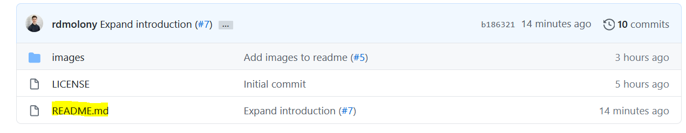
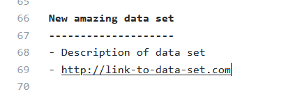
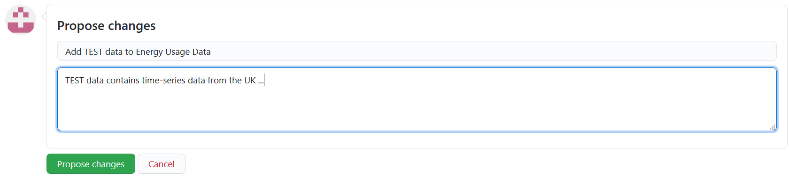

Energy Data Sources
===================

This repository contains URL links & descriptions to a collection of energy-related data sources for Ireland.  

All data listed here is either: 
- [open access](https://en.wikipedia.org/wiki/Open_access) (the default)   
- `Available upon request`
  - i.e. is accessible via an application process with the relevant body
- `Available upon purchase`
- `Available upon subscription`

__Have a new data source or publication to add or found a broken data source URL?__ Great! Please email us at `energy-modelling-ireland-admin@googlegroups.com` with:

```
Name of source:  Irish Social Science Data Archive (ISSDA)

Short description:  "The Irish Social Science Data Archive (ISSDA) is Ireland’s leading centre for quantitative data acquisition, preservation, and dissemination. Based at UCD Library, its mission is to ensure wide access to quantitative datasets in the social sciences, and to advance the promotion of international comparative studies of the Irish economy and Irish society."

URL link to source:  https://www.ucd.ie/issda/data/

The Raw Data file (if there is currently no URL to the data source)
```

and/or

```
Publication in Harvard referencing style
```


> See the [Data Wishlist](#data-wishlist) for a list of data sources that we would love but do not yet have!

__Want to contribute through Github instead?__ Please follow the [`how-to-contribute`](#how-to-contribute) guide below.  All changes will be reviewed prior to being published on this website so don't worry about breaking anything with your edits :smiley: 

> Please upload your data to [Zenodo](https://zenodo.org) and link it here via URL rather than uploading it to this Github repository.

Special thanks to researchers at:

<a href="https://www.codema.ie/">
  
</a>
&emsp;
<a href="https://messo.cit.ie/">
  
</a>
&emsp;
<a href="http://www.nuigalway.ie/">
  
</a>
&emsp;
<a href="https://www.tudublin.ie/">
  
</a>
&emsp;
<a href="https://www.ucc.ie/en/">
  
</a>
&emsp;
<a href="https://www.ucd.ie/">
  
</a>
&emsp;


---
---


Table of Contents
=================

<!--ts-->
* [Appliance Usage](#appliance-usage)
* [Benchmarks](#benchmarks)
* [Building Fabric](#building-fabric)
* [Data Catalogues](#data-catalogues)
* [Data Wishlist](#data-wishlist)
* [Energy Consumption](#energy-consumption)
* [Emissions](#emissions)
* [Geodata](#geodata)
* [Policy](#policy)
* [Publications](#publications)
* [Technical References](#technical-references)
* [Waste and Landfill](#waste-and-landfill)
* [Weather](#weather)
* [Webtools](#webtools)
* [How to Contribute?](#how-to-contribute)
<!--te-->


---
---


Appliance Usage
===============

United Kingdom Time Use Survey, 2014-2015
-----------------------------------------
- "The United Kingdom Time Use Survey, 2014-2015 (UKTUS) is a large-scale household survey that provides data on how people aged 8 years and over in the UK spend their time. At the heart of the survey is a time diary instrument in which respondents record their daily activities. Time diaries record events sequences for prescribed periods, usually a single day."
- https://beta.ukdataservice.ac.uk/datacatalogue/studies/study?id=8128

Commission for Regulation of Utilities (CRU) Smart Meter Trials
---------------------------------------------------------------
- `Available upon request`
- __Survey of participants links typical appliance usage to building IDs__ 
- https://www.ucd.ie/issda/data/commissionforenergyregulationcer/


---
---


Benchmarks
==========

Chartered Institute of Building Services Engineers (CIBSE) TM46: Energy Benchmarks (2008)
-----------------------------------------------------------------------------------------
- `Available on purchase`
  - €55
- Commercial sector building fossil fuel and electricity benchmarks by building type from a CIBSE Study 'Energy & CO2 emissions benchmarks for non-domestic buildings' from 2007.
- __Note:__ CIBSE has updated these benchmarks in Guide F (2012)
  - "This platform [energy benchmarking tool] aims to gradually update and replace the energy benchmarks in table 20.1 of CIBSE Guide F: Energy Efficiency in Buildings."
- URL: https://www.cibse.org/Knowledge/knowledge-items/detail?id=a0q20000008I7evAAC
- Benchmarking tool: https://cibse.org/knowledge/energy-benchmarking-tool-beta-version

Chartered Institute of Building Services Engineers (CIBSE) Guide F: Energy Efficiency in Buildings (2012)
---------------------------------------------------------------------------------------------------------
- `Available on purchase`
  - €114
- Commercial sector building fossil fuel and electricity benchmarks by building type used by the CIBSE Energy Benchmarking Tool
- __Note:__ CIBSE is phasing out these benchmarks in favour of DEC-based benchmarks (see UK DEC above) 
  - "Revised benchmarks have been introduced for some building types (see below) which are based on the Display Energy Certificates (these covered more than 120k DECs – for details, see full report) analysed by UCL under a jointly sponsored project."
- URL: https://www.cibse.org/Knowledge/knowledge-items/detail?id=a0q20000008I7oTAAS
- Benchmarking tool: https://cibse.org/knowledge/energy-benchmarking-tool-beta-version


---
---


Building Fabric
===============

CSO 2016 Census Small Area Statistics
-------------------------------------
- Building data (period built, dwelling type, boiler type ...) for all households in Ireland who participated in the 2016 Census at Small Area level (i.e. areas of population generally comprising between 80 and 120 dwellings). 
- https://www.cso.ie/en/census/census2016reports/census2016smallareapopulationstatistics/
- Click `Small Areas (18,641) -` to download a `csv` file containing the Small Area Statistics.
- Click `SAPS 2016 Glossary (XLS 38KB)` to download an `xlsx` file containing the column name decodings (for example: from `T6_1_HB_H` decodes to `House/Bungalow (No. of households)`).
  - See [drem](https://github.com/codema-dev/drem) for more information on cleaning this data set for Dublin using Python.

SEAI's BER Public Search
------------------------
- Building data (type of heating, building geometry ...) for all households in Ireland who have had their household's BER rating evaluated.
- Updated nightly
- https://ndber.seai.ie/BERResearchTool/Register/Register.aspx

Valuation Office API
--------------------
- Building data (floor areas ...) for all Commercial buildings in Ireland
- __Note:__ Apply benchmarks to these floor areas to estimate commercial building energy usage
- https://opendata.valoff.ie/api/

Air Tightness Ireland Field Data houses 1944-2008 (2012)
--------------------------------------------------------
- Air-tightness field data for dwellings in Ireland.
  - "Air permeability test results of 28 houses built between 1944 and 2008 and at varying stages of retrofit."
- https://doi.org/10.1016/j.buildenv.2011.11.016

Air Tightness UK Field Data houses post-2006 (2010)
---------------------------------------------------
- Air-tightness field data for dwellings in the UK.
  - "This paper reports on the air permeability test results of 287 post-2006 new-build dwellings in the UK."
- https://doi.org/10.1016/j.buildenv.2010.04.011

SEAI Better Homes
-----------------
- `Available upon request`
- _Irish Residential Energy Efficiency Program Data_ used in [Ali et al, 2020](https://doi.org/10.1016/j.apenergy.2020.115834)
  - "The Irish retrofit housing scheme dataset contains quantitative data for residential buildings that have completed energy upgrades through one of SEAI’s programs. Homeowners apply to SEAI for grants which subsidize the cost of their upgrades. Maintained by SEAI, the dataset comprises 265,182 retrofitted buildings and includes homes which have been upgraded through one of SEAI’s energy upgrade programs such as Better Energy Homes, Warmer Homes, Better Energy Communities, and the Deep Retrofit pilot program"
- URL:  https://www.seai.ie


---
---


Data Catalogues
===============

Irish Social Science Data Archive (ISSDA)
-----------------------------------------
- "The Irish Social Science Data Archive (ISSDA) is Ireland’s leading centre for quantitative data acquisition, preservation, and dissemination. Based at UCD Library, its mission is to ensure wide access to quantitative datasets in the social sciences, and to advance the promotion of international comparative studies of the Irish economy and Irish society."
- https://www.ucd.ie/issda/data/

UK Energy Research Centre (UKERC) Data Catalogue   
------------------------------------------------
- Compilation of energy related publications for the United Kingdom
- https://ukerc.rl.ac.uk/DC/cgi-bin/edc_search.pl?GoButton=Related&WantComp=40

Ordinance Survey Ireland (OSI)
------------------------------
- Ordnance Survey Ireland has evolved from the Ordnance Survey Office which was established in 1824, later becoming a state body under the Ordnance Survey Ireland Act 2001. Under this Act, Ordnance Survey Ireland continued its mainstream public service function of creating and maintaining the definitive mapping records of the State and also assumed the commercial function assigned to it under the Act of developing its commercial business and sales revenues.  The work of OSi is essential to the infrastructural development of Ireland. There is a growing recognition among decision makers that knowledge and understanding of location is a key component in effective decision making. To this end, OSi has designed and developed a standardised, authoritative digital referencing framework that enables the consistent referencing and integration of national data related to location. This framework, known as PRIME2, provides the means for GIS data users to accurately integrate and use multiple data sources to provide for better analysis and decision making, optimising resources and delivering efficiencies.
- Contains `Open-access`, `Available upon purchase` & `Available upon subscription` data
- Open-data: https://data.gov.ie/organization/ordnance-survey-ireland
- Open-data portal: https://data-osi.opendata.arcgis.com/
- URL: https://www.osi.ie/
- _Dublin City Building footprint_ used in [Ali et al, 2020](https://doi.org/10.1016/j.apenergy.2020.115834)

UCD Spatial Data for Ireland
----------------------------
- Contains a wide category of GIS files for desired applications filtered accordingly
- URL: https://libguides.ucd.ie/gisguide/FindSpatialData

World Urban Database and Access Portal Tools (WUDAPT)
-----------------------------------------------------
- The World Urban Database and Access Portal Tools (WUDAPT) project seeks to acquire and store urban data using a common framework and to link these data to available methods for climate analysis and for current and what-if scenario development. Present global-scale urban data and land use at the city level is derived from global land cover data sets; examples include AVHRR, MODIS GLCF and ESA GlobCover
- Includes climate geodata for Dublin & Cork
- http://www.wudapt.org


---
---


Data Wishlist
=============
- Metered Electricity Consumption Data at as fine a spatial and temporal granularity as possible!
- Netork Gas Consumption data at a Small Area level (see [Energy Consumption](#energy-consumption) for a Postcode-level demand data source)
- Pre and Post Retrofit Costs & Fabric Data

To investigate the costs and benefits of residential deep renovation in Ireland.
- Define an irish experiment that evaluates 100+ houses in terms of renovation efficacy.
- Pre-renovation energy consumption baselines to be established based on utility bills, also record pre-renovation BER
- Record renovation intent and updates to this intent.
- Detailed logging of renovation measures, costs and timeframes.
- Post-renovation energy consumption to be established based on utility bills, also establish post-renovation BER.


---
---


Energy Consumption
==================

Commission for Regulation of Utilities (CRU) Smart Meter Trials
---------------------------------------------------------------
- `Available upon request`
- Electricity meter data at 15-minute resolution for a sample of 5,000 Irish homes and businesses between 2009-10
- Gas meter data at 15-minute resolution for a representative sample of nearly 2,000 Irish homes between 2010-11
- https://www.ucd.ie/issda/data/commissionforenergyregulationcer/

Carbon Trust Advanced Metering Trial (2004-2006)
------------------------------------------------
- `Available upon request`
- Half hourly gas and electricity (and water) consumption data (not all utilities were monitored at every site) gathered during the Carbon Trusts Advanced Metering for SMEs project (2004-2006) in United Kingdom Regions of England, Wales and Scotland.  
- Meter readings are available for small and medium-sized enterprises (SMEs).  The sectors covered are:
  - Community, social and personal activities
  - Education
  - Financial and business services
  - Government
  - Health and social work
  - Manufacturing
  - Other sectors
  - Wholesale and retail trade
- https://ukerc.rl.ac.uk/DC/cgi-bin/edc_search.pl/?WantComp=30

Gas Network's Ireland Networked Gas Consumption
-----------------------------------------------
- Annual Gas consumption data for all Irish Power Plants, Residential & Non-Residential
- https://www.cso.ie/en/statistics/climateandenergy/networkedgasconsumption/

Environmental Protection Agency (EPA) Annual Energy Use
-------------------------------------------------------
- Annual Gas & Electricity data for Emissions Trading System (ETS) industrial buildings.  
- As part of their licencing and permits companies have to submit an annual environmental report
- http://epa.ie/licensing/
- Rebecca Cachia (Codema - Dublin's Energy Agency) extracted all energy data for 47 industrial buildings in Dublin (November, 2019).
- https://zenodo.org/record/4048377

Mortar
------
- "The goal of Mortar is to provide a large, diverse and consistently updated testbed of buildings and building data to facilitate reproducible evaluation of building analytics.  At this time, Mortar contains 107 buildings, spanning over 10 billion data points and 26,000 data streams."
- https://mortardata.org/

Energy Performance of Buildings Data: England and Wales
-------------------------------------------------------
- The domestic and non-domestic Energy Performance of Buildings Registers (the registers) are the official place for all Energy Performance Certificates (EPCs), Display Energy Certificates (DECs) and Air Conditioning Inspection Reports (ACIRs).
- https://epc.opendatacommunities.org/

SEAI Measurement & Reporting Data (M&R)
---------------------------------------
- `Available upon request`
- Energy Demands for M&R Public Sector buildings.
- More information: https://www.seai.ie/business-and-public-sector/public-sector/monitoring-and-reporting/
- SEAI contact page: https://www.seai.ie/contact-us/


---
---


Emissions
=========

SEAI Conversion Factors
-----------------------
- Calorific values, Emission factors, Fuel densities, Primary energy conversion factors
- URL: https://www.seai.ie/data-and-insights/seai-statistics/conversion-factors/
- Derivation Methodology: https://www.seai.ie/publications/DEAP-Elec-Factors-2017.pdf

Environmental Protection Agency (EPA) Licensing and Permitting
------------------------------------------------------------
- Industrial Emissions
- As part of their licencing and permits Emissions Trading System (ETS) industrial buildings have to submit an annual environmental report.
- URL: http://epa.ie/licensing/


---
---


Geodata
=======

SEAI's 2016 Census Small Area Geometries 
----------------------------------------
- Mappable (in QGIS) geometries for all Small Areas.
- https://www.cso.ie/en/census/census2016reports/census2016smallareapopulationstatistics/
- Click `Small Areas UG`

Shane McGuinness' (of Trinity College) Dublin Postcodes Geometries
------------------------------------------------------------------
- Mappable (in QGIS) shapefile geometries for all Dublin Postcodes.
- https://github.com/rdmolony/dublin-postcode-shapefiles)

GeoDirectory
------------
- `Available upon subscription`
- GeoDirectory was established by An Post and Ordnance Survey Ireland over 20 years ago to manage and maintain a database used as the de-facto standard of addressing in Ireland. The database contains every residential and commercial building in Ireland with details for each address - location codes (3 types), EDs, Small Areas and Unique Building Identifier.  As well as information such as the type of property (Terraced/ Semi Detached, Industrial Unit,  etc), other details include whether  the property is a new build, occupied, vacant or derelict and the type of business being undertaken in the building if it is commercial. 
- UCD Staff & Students: https://libguides.ucd.ie/gisguide/GeoDirectory
- URL: https://www.geodirectory.ie/
- Used in [Ali et al, 2020](https://doi.org/10.1016/j.apenergy.2020.115834)


---
---


Policy
======
Energy Performance of Buildings Directive
-----------------------------------------
- The EU has established a legislative framework that includes the Energy Performance of Buildings Directive 2010/31/EU (EPBD) and the Energy Efficiency Directive 2012/27/EU. Part L of the Building Regulations Conservation of Fuel and Energy in Dwellings sets the energy and carbon dioxide emissions requirements for new and existing buildings subject to the Building Regulations.
- Latest Irish-EPBD policy & reports: https://www.housing.gov.ie/housing/building-standards/energy-performance-buildings/energy-performance-buildings
- Latest standards energy efficiency standards for new dwellings: https://www.housing.gov.ie/housing/building-standards/energy-performance-buildings/new-energy-efficiency-standards-new
- Cost Optimal Residential Report Ireland 2018: https://www.housing.gov.ie/housing/building-standards/energy-performance-buildings/cost-optimal-residential-report-ireland-2018


---
---


Publications
============

- Ahern, C. and Norton, B., 2020. A generalisable bottom-up methodology for deriving a residential stock model from large empirical databases. Energy and Buildings, 215, p.109886 https://doi.org/10.1016/j.enbuild.2020.109886
- Ali, U., Shamsi, M.H., Bohacek, M., Purcell, K., Hoare, C., Mangina, E. and O’Donnell, J., 2020. A data-driven approach for multi-scale GIS-based building energy modeling for analysis, planning and support decision making. Applied Energy, 279, p.115834 https://doi.org/10.1016/j.apenergy.2020.115834
- Ali, U., Shamsi, M.H., Bohacek, M., Hoare, C., Purcell, K., Mangina, E. and O’Donnell, J., 2020. A data-driven approach to optimize urban scale energy retrofit decisions for residential buildings. Applied Energy, 267, p.114861 https://doi.org/10.1016/j.apenergy.2020.114861
- Nielsen, O.K., Plejdrup, M.S., Bruun, H.G., Gyldenkærne, S. and Christensen, J.H., 2019. MapEIre-National mapping of GHG and non-GHG emissions sources project. https://projects.au.dk/mapeire/project-description/.
- Ali, U., Shamsi, M.H., Hoare, C., Mangina, E. and O’Donnell, J., 2019. A data-driven approach for multi-scale building archetypes development. Energy and Buildings, 202, p.109364 https://doi.org/10.1016/j.enbuild.2019.109364
- Ahern, C., 2019. Introducing the Default Effect: Reducing the Gap Between Theoretical Prediction and Actual Energy Consumed by Dwellings Through Characterising Data More Representative of National Dwellings Stocks. 

---
---


Technical References
====================

CIBSE Guide A
-------------
- `Available on purchase`
  - €98
- A UK technical reference source for designers and installers of heating, ventilating and air conditionings services.
- URL: https://www.cibse.org/knowledge/knowledge-items/detail?id=a0q20000008I79JAAS
- Blog: https://www.cibsejournal.com/general/guide-a-cibses-essential-guide-to-environmental-design-explained/


---
---


Waste and Landfill
==================

Environmental Protection Agency (EPA) Licensing and Permitting
------------------------------------------------------------
- Industrial Waste & Landfill
- As part of their licencing and permits Emissions Trading System (ETS) industrial buildings have to submit an annual environmental report.
- URL: http://epa.ie/licensing/


---
---


Weather
=======

Met Eireann Historical Data
---------------------------
- Historical Irish weather data
- URL: https://www.met.ie/climate/available-data/historical-data

ASHRAE International Weather for Energy Calculations v2 (IWEC2)
---------------------------------------------------------------
- `Available on purchase`
  - €94 for all-Ireland
  - €34 for an individual station
- The files are derived from Integrated Surface Hourly (ISH) weather data originally archived at the National Climatic Data Center. For these selected locations, the ISH database contains weather observations on average at least four times per day of wind speed and direction, sky cover, visibility, ceiling height, dry-bulb temperature, dew-point temperature, atmospheric pressure, liquid precipitation, and present weather for at least 12 years of records up to 25 years.
- URL: http://ashrae.whiteboxtechnologies.com/IWEC2

EnergyPLUS Weather Data
-----------------------
- Weather data for more than 2100 locations are now available in EnergyPlus weather format — 1042 locations in the USA, 71 locations in Canada, and more than 1000 locations in 100 other countries throughout the world.
- URL: https://energyplus.net/weather

---
---


Webtools
========

National Building Energy Retrofit Testbed (NBERT)
-------------------------------------------------
- The National Built Energy Retrofit Test-bed (NBERT) is a 223m2 educational building that is part of the wider Cork Institute of Technology (CIT) main campus in Bishopstown, Co. Cork, Ireland. The NBERT building is a renovated part of the existing CIT main campus building which was designed in 1974.  The retrofit project was completed in 2012 and now functions as live test-bed for research activities for micro-grid, ventilation and thermal comfort applications.
- The NBERT building has capabilities in monitoring and gathering long term data for a range of parameters relating to energy and environmental performance. Data relating to energy and environmental systems is collected from a Cylon Building Management System (BMS) while data relating to the internal environment is collected from a Hanwell wireless data logging system. The BMS gathers data on internal air temperatures, energy consumption for general services, lighting, and energy consumption of the buildings Air Source Heat Pump. It also measures the position of actuators for the Multi Configuration Slotted Louvre ventilation system in the building. Externally, NBERT has an on-site weather station located on top of the building at a height of five metres above roof level. Static data sets have been published to the NBERT online Data Portal. The data portal currently contains four years of data from 2013-2016 and there are three main data types: Weather data, Internal Environmental data, Energy data
- URL: https://nbert-research.squarespace.com

TABULA
------
- The aim of the Intelligent Energy Europe TABULA project (2009-2012) is to create a building typology in each of the member states participating in the project. In the case of Ireland, the building typology aims to identify the most common residential building types and to provide relevant building energy information for each type that will be of use to home owners and building professionals alike.
- Summary: https://energyaction.ie/projects/tabula.php
- Webtool: http://webtool.building-typology.eu/?c=all
- Guide: http://www.building-typology.eu/downloads/public/docs/TABULA_WebTool_UserGuide.pdf
- Report: http://www.building-typology.eu

BER Map
-------
- "We have developed a BER map of Ireland that will give you access to building energy information on dwelling clusters within Ireland. This map has been designed to showcase the benefits of using geo-located BER data. The underlying data has also been provided below to allow others to undertake their own analysis and mapping projects. The data was originally collected by BER Assessors when they completed a BER assessment using the Dwelling Energy Assessment Procedure (DEAP) software. The small area clusters on the map correspond to ‘Small Areas’ as defined by the Central Statistical Office. Small Areas are areas of population generally comprising between 80 and 120 dwellings created by The National Institute of Regional and Spatial Analysis (NIRSA) on behalf of the Ordnance Survey Ireland (OSi) in consultation with CSO. The map only contains Building Energy Rating Information at the Small Area level for dwellings that have had a BER completed and where their address has been successfully geo-located using SEAI’s address matching algorithm. Please note that the current BER Map only contains information on 33% of the total Irish residential dwelling stock. Although the information is very accurate, in some cases, the number of successfully mapped dwellings in a Small Area can be a relatively small proportion of the total number of dwellings in that area."
- Webtool: https://www.seai.ie/technologies/seai-maps/ber-map/ 
- Raw Data: https://www.seai.ie/technologies/seai-maps/ber-map/BER_data.csv
- Glossary: https://www.seai.ie/technologies/seai-maps/ber-map/Description-of-variables-for-BER-map.xlsx


---
---


How to contribute?
==================

Here’s a quick guide to editing GitHub Markdown files on GitHub, if you’re new to this:

- Scroll up to the top of this page and Click on the `README.md` file



- You should now be able to see a pencil icon in the top-right corner of the page.  Click it!


- Scroll down and make changes ([here’s a lovely Markdown tutorial](https://commonmark.org/help/tutorial/) if you need it) in the following format:

```
Title of Data Source
--------------------
- `Available upon request` if have to contact the data owner for access
- Description of Data Source ...
- http://www.link-to-data.ie/thedata/

```



- Scroll down to `Propose Changes`, summarise the changes & add a quick explanation on why the change should be made.



- Click `Create pull request`. Thank you! 🎉


> Adapted from [`list-of-python-api-wrappers`](https://github.com/discdiver/list-of-python-api-wrappers/blob/master/readme.md) and this excellent [Medium.com article](https://towardsdatascience.com/how-to-get-data-from-apis-with-python-dfb83fdc5b5b)

