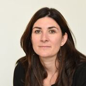
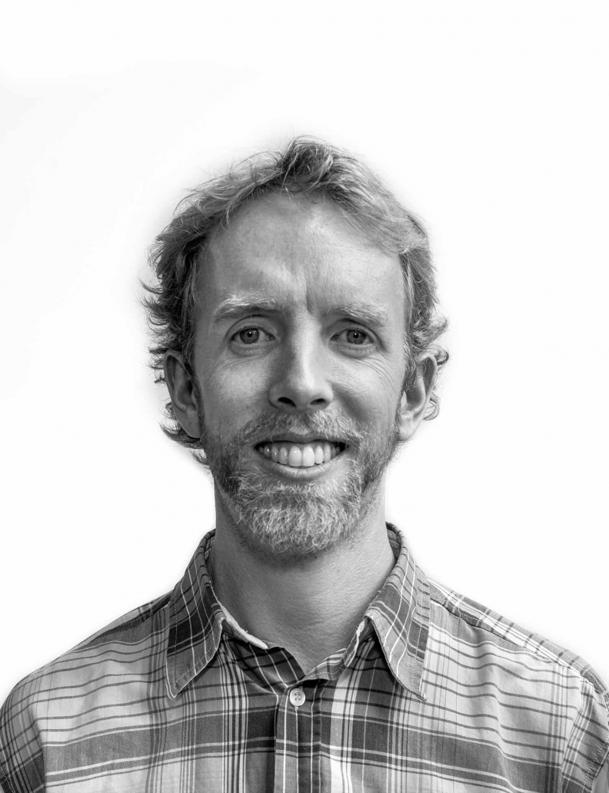

# Bios

 
## Codema - Dublin's Energy Agency

<table>
  <tr>
    <td>
      
 
          
      
 
      Oisín is an Junior Energy Systems Analyst at <a href="https://www.codema.ie">Codema - Dublin's Energy Agency</a>. He is a UCD graduate working on the Dublin Region Energy Masterplan, primarily through the form of open-sourced Python scripting for which more info can be found on our <a href="https://github.com/codema-dev">codema-dev</a> Github.
    </td>
  </tr>
  <tr>
    <td>
      
      
      
    </td>
  </tr>
</table>

<table>
  <tr>
    <td>
      
 
          
      
 
      Rowan Molony is an Energy System Modeller at <a href="https://www.codema.ie">Codema - Dublin's Energy Agency</a> where he is working on the open-source SEAI RD&D funded <a href="https://www.codema.ie/projects/local-projects/dublin-region-energy-master-plan/">Dublin Region Energy Masterplan Project</a>.  See the <a href="https://github.com/codema-dev">codema-dev</a> Github account to access all of the software being developed as part of this project.
    </td>
  </tr>
  <tr>
    <td>
      
      
      
      
    </td>
  </tr>
</table>

---

## NUI Galway

<table>
  <tr>
    <td>
      
 
          
      
 
      Paul is a Postdoctoral Researcher with his research work focusing on sustainable construction technologies for building and retrofitting residential buildings, developing one-stop-shop retrofit services and the examining the interrelationships between building occupants, building systems, and building energy consumption.
        
      He is currently working on the EU funded TURNKEY RETROFIT project which aims to create a service which will transform the complex and fragmented renovation process into a simple, straightforward and attractive process for the home-owner. The service will be accessible through a user-friendly digital platform and it will address drivers of building renovation that go beyond a desire to reduce energy bills and increase asset value, such as home improvement, increased comfort, enhanced health and quality of life.
    </td>
  </tr>
  <tr>
    <td>
      
      
      
      
    </td>
  </tr>
</table>

---

## TUDublin

<table>
  <tr>
    <td>
      
 
          
      
 
      A chartered building services engineer currently serving as Head of Building Engineering within the College of Engineering and Built Environment in Technological University Dublin.  Dr. Ahern is a funded investigator with SFI/MaREI with active research activity in the area of energy resilience within the built environment.  Alongside an academic career, Dr. Ahern has 12 years industrial experience practicing as a consultant design engineer on residential and commercial building projects.  
        
      Dr. Ahern's research interests involve building energy stock modelling and she is currently investigating how modelling outputs to inform policy can be made in real-time and in a robust fashion using artificial intelligence and machine learning to advance current analysis techniques.  Dr. Ahern has been using the Irish housing stock for case study analysis for over 10 years and is expert in thermo-physical characteristics of the Irish housing stock, having tested the viability of integrating heat pumps into the thermally refurbished stock in 2010.  
        
      Dr. Ahern is the Minister of Education and Skills nominee to the board of the Construction Industry Register Ireland (CIRI), established to develop and promote best practice in buildings and construction. Ciara has led a European Research project in the area of heating systems optimization, is a member of Engineers Ireland, the American Society of Heating Refrigeration and Air Conditioning Engineers, the European Sustainable Energy Innovation Alliance and the European Energy Research Alliance. Ciara has also participated on the National Standard Authority of Ireland’s Building Services Committee. 
    </td>
  </tr>
  <tr>
    <td>
      
      
      
      
    </td>
  </tr>
</table>

---

## University College Cork (UCC)

<table>
  <tr>
    <td>
      
 
          
      
 
      Fionn Rogan is a Senior Research Fellow at UCC. Fionn's research interests and current activities include modelling energy policies, simulation modelling, energy innovation, diffusion of innovations, sustainable energy workshops.
    </td>
  </tr>
  <tr>
    <td>
      
      
      
      
    </td>
  </tr>
</table>

<table>
  <tr>
    <td>
      
 
          
      
 
      Jason Mc Guire is working on building the residential sector in the TIMES energy system optimization model, to provide discussion and inputs for Climate Action Plan 2021. He's also planning to explore Ireland's carbon budgets pathways.
    </td>
  </tr>
  <tr>
    <td>
      
      
      
    </td>
  </tr>
</table>

<table>
  <tr>
    <td>
      
 
          
      
 
      Tomás Mac Uidhir is a postdoctoral researcher in MaREI and is located in the Environmental Research Institute in UCC. Tomás is an expert developer of the Low Emissions Analysis Platform (LEAP) energy system model for Ireland. He is interested in developing simulation models which provide insights into policy implementation pathways.
    </td>
  </tr>
  <tr>
    <td>
      
      
      
      
      
      
    </td>
  </tr>
</table>

---

## University College Dublin (UCD)

<table>
  <tr>
    <td>
      
 
          
      
 
      Divyanshu's research is in the area of development of Next Generation Building Archetypes and associated with the project titled "ALIVE - Assessing Indoor Environmental Quality and Energy Efficiency In a range of Naturally-Ventilated Buildings." The research focuses on the effect of natural ventilation on the energy performance of the building and indoor environmental quality in the context of Irish buildings. Also, he is a member of (International Building Performance Simulation Association) IBPSA Project-1 wherein he is working on a taxonomy based review paper on City Quarter Information Modelling for Building Energy. 
    </td>
  </tr>
  <tr>
    <td>
      
      
    </td>
  </tr>
</table>
